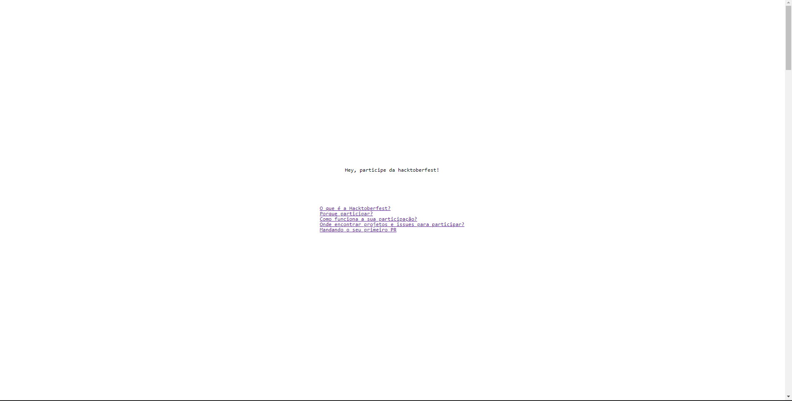

# 🌸 Participe da Hacktoberfest 🌸

> Esse projeto consiste em mostrar para as pessoas o que é a hacktoberfest e o mundo open-source ao mesmo tempo em que as mesmas participam e contribuem nele.

### Leia o artigo que originou esse projeto [aqui](https://dev.to/levxyca/inicie-no-mundo-open-source-participando-da-hacktoberfest-3np6).

## 📫 Contribuindo

Primeiramente, para fazer parte desse projeto, leia nosso [guia de contribuição](CONTRIBUTING.md)!

Para mandar seu PR, siga estas etapas:

1. Dê um fork neste repositório.
2. Crie um branch: `git checkout -b <nome_branch>`.
3. Faça suas alterações e confirme-as: `git commit -m '<mensagem_commit>'`
4. Envie para o branch original: `git push origin <nome_do_projeto> / <local>`
5. Crie a solicitação de pull.

Como alternativa, consulte a documentação do GitHub em [como criar uma solicitação pull](https://help.github.com/en/github/collaborating-with-issues-and-pull-requests/creating-a-pull-request).

Feito com 💙 por [levxyca](https://levxyca.codes/)
